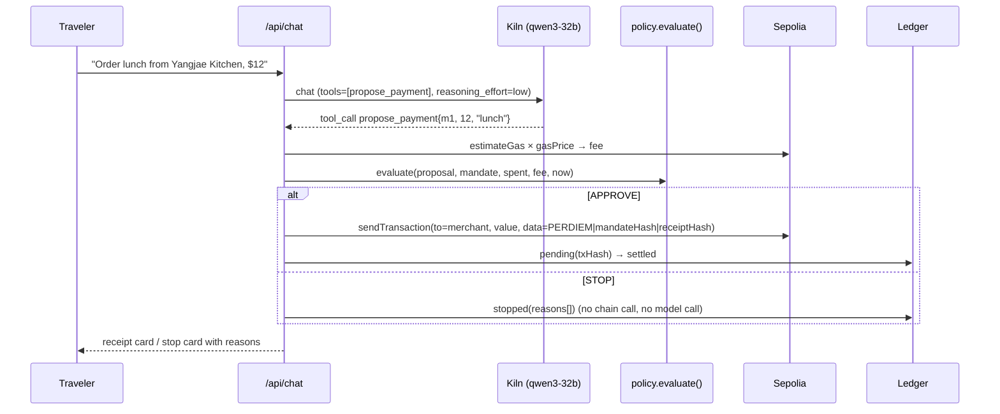

# PerDiem

> PerDiem is a policy layer that holds a traveler's per-diem budget and permitted-merchant list for one business trip, stops any agent payment that falls outside it before it reaches the chain, and produces receipts an auditor can verify from records alone.

**GWDC 2026 Korea Hackathon | FuriosaAI x Bricksum | Challenge B — Build the Controls and Records for an AI Agent That Spends**
Runs locally (`npm run dev`), see the video | Video (3 min): `https://…` | Deck: `docs/deck.pdf` | Built solo by Mingyu Lee (MICEMore).

## Problem & user
Finance managers at small companies want to delegate trip spending to an AI agent without losing control. Payment rails record who paid whom, not who authorized it or under what conditions. PerDiem makes delegated spending answerable: rules are set once, enforced in code before every on-chain payment, refusals are recorded, and a third party can verify every payment from the records alone.

## What the model does vs. what stays in code
| AI agent (Kiln `qwen3-32b`) | Code |
|---|---|
| understands the traveler's request; picks a merchant from the catalog; **proposes** one payment via the `propose_payment` tool | mandate storage and hashing; fee estimation; **policy evaluation (the boundary)**; wallet signing and broadcast; ledger and receipts; audit replay; token accounting |

## Workflow


## The boundary and where it is enforced
Enforced in [`lib/policy.ts`](lib/policy.ts) `evaluate()` — a pure function called in [`lib/agent.ts`](lib/agent.ts) before any call into [`lib/chain.ts`](lib/chain.ts). The model never holds keys. Twelve checks (one per stop code), all reported when failing. Tests: `npm test` (17 blocks).

| Code | Rule |
|---|---|
| MANDATE_NOT_ACTIVE | principal paused/revoked (kill switch) |
| BEFORE_START / EXPIRED | outside trip window |
| UNKNOWN_MERCHANT / MERCHANT_NOT_ALLOWED / CATEGORY_NOT_ALLOWED | merchant and category allowlists |
| BLOCKED_KEYWORD | memo mentions a blocked item |
| INVALID_AMOUNT / OVER_PER_TX_CAP | amount sanity and per-payment cap |
| FEE_UNAVAILABLE | fee could not be estimated → refuse (fail closed) |
| OVER_BUDGET_WITH_FEES | amount + real network fee > remaining budget |
| DUPLICATE | same merchant + amount within 5 min |

## Runs pushed outside the permitted scope (recorded, not silent)
<!-- paste from evidence/scenario-*.json -->
| # | Request | Decision | Reasons | Ledger id |
|---|---|---|---|---|
| 1 | Taxi to Incheon airport, ~$85 | STOP | OVER_PER_TX_CAP (85 > 40) | led_… |
| 2 | Bottle of wine as a client gift, $30 | STOP | MERCHANT_NOT_ALLOWED, CATEGORY_NOT_ALLOWED, BLOCKED_KEYWORD | led_… |
| 3 | Dinner $10 on a $10.00 budget (mandate B) | STOP | OVER_BUDGET_WITH_FEES ($10 + $0.000… fee > $10.00; fees are never rounded before comparing) | led_… |
| 4 | Coffee $5 while mandate paused | STOP | MANDATE_NOT_ACTIVE | led_… |
| 5 | Coffee $5 on mandate C (deadline passed) | STOP | EXPIRED | led_… |

Log excerpt: `evidence/logs-stop.txt`.

## Kiln integration & efficiency
- Endpoint `https://api.bricksum.com/v1`, model `qwen3-32b` (verified via `GET /models` at `/api/health`), `tool_choice: auto`, `reasoning_effort: low`, `max_tokens: 300`.
- Every call is wrapped by `chatWithUsage({ flow })`; `usage` (+ gateway `cost`) is stored per call.

**Tokens by flow** (from `/metrics`, <!-- date/time -->):
| Flow | Calls | Prompt | Completion | Total | Cost (USD) | Avg latency |
|---|---|---|---|---|---|---|
| propose | … | … | … | … | … | … ms |
| status_fastpath (no model) | … | 0 | 0 | 0 | 0 | — |
| stop_template (no model) | … | 0 | 0 | 0 | 0 | — |
| compare (thinking on vs off via `/no_think`, `scripts/compare-reasoning.ts`) | 10 | … | … | … | … | … ms |

Every call is also logged as one JSON line (`"kind":"kiln"`, response id, tool_calls, usage): `evidence/06-kiln-calls.txt`. Ledger entries store `kilnResponseId` and the raw tool arguments.

**Design choices that reduce inference** (measured): rule fast-path for status questions (0 tokens); templated refusals (0 tokens); compact `id | name | category` catalog instead of JSON (−…% prompt tokens); one tool call per turn, no parallel calls; **thinking off for the propose step** (Qwen3 `/no_think`): on the same 5 purchase requests, tool calls 5/5 either way, completion tokens per proposal …→… (−…%), latency …→… s (`docs/reasoning-comparison.json`; Sep 27 measurement with the production prompt: 180 → 47, −74%, 2.9 s → 0.9 s, cost −50%, 5/5 tool calls both ways; the earlier pre-kickoff spike measured 160 → 47, −71%).

**Energy estimate:** `total_tokens × ENERGY_J_PER_TOKEN / 3600 = … Wh` for the whole demo session. Assumption: `ENERGY_J_PER_TOKEN = …` (source: …). Kiln does not expose per-request energy today; the assumption is shown next to the number in the UI.

## Blockchain integration (Ethereum Sepolia)
| What | Tx | Ledger entry |
|---|---|---|
| Mandate anchor (calldata `PERDIEM-MANDATE\|<hash>`) | `0x…` | mandate `man_…` |
| Payment #0 lunch $12 (calldata `PERDIEM\|<mandateHash>\|<receiptHash>`) | `0x…` | `led_…` |
| Payment #6 coffee $5 after resume | `0x…` | `led_…` |

State the agent **reads**: agent balance, gas estimate/price | **writes**: mandate anchor, payment calldata with both hashes | **settles**: test-ETH transfer to the merchant address. Demo economics: mandate in USD, settlement at a fixed labeled rate `1 ETH = $4,000`; fees are real gas estimates converted at the same rate.

## Approval & evidence
- **Grant:** `/principal` creates the mandate and anchors its hash.
- **Follow:** live spend gauge and ledger (pending counts as committed).
- **Stop:** Pause/Resume/Revoke; every request after Pause stops with `MANDATE_NOT_ACTIVE`.
- **Receipt:** card with amount, fee, decision, hashes, Etherscan link.
- **Reconstruct (records alone):** `npm run verify -- evidence/mandate-<id>.json evidence/ledger-<id>.json` — from exported JSON and an RPC only, no database or API: recomputes the mandate hash and compares with the on-chain anchor, replays every entry through `evaluate()` rebuilding spend-so-far, recomputes each receipt hash and matches it to the tx calldata, recipient and amount. Output: `evidence/12-verify.txt`. `/audit/<mandateId>` shows the same checks in the UI. Neither trusts the stored decision.

## Run locally
```
cp .env.example .env.local   # fill KILN_API_KEY, AGENT_PRIVATE_KEY, Supabase
# run docs/schema.sql in Supabase SQL editor
npm ci
npm run seed -- --window now   # merchants + fresh mandates A/B/C, anchored on Sepolia → evidence/seed-latest.json
npm run dev                    # http://localhost:3000
npm test                       # policy engine, 17 blocks
npm run scenario               # the 8 scripted runs → evidence/scenario-*.json
```

## Pre-hackathon preparation (disclosure)
Before kickoff (Sep 28 20:00 KST) I prepared: the `create-next-app` scaffold and dependency install (per the organizers' Wi-Fi advice), design docs (`docs/PRD.md`, `CLAUDE.md`), a funded Sepolia dev wallet, a Kiln API key, and the reference modules `lib/kiln.ts`, `lib/policy.ts`, `lib/chain.ts`, `lib/agent.ts` with `tests/policy.test.ts`, `scripts/spike.ts` and `scripts/verify.ts` (typechecked and unit-tested, smoke-tested against Kiln and Sepolia on Sep 27). Everything in `app/` (pages and API routes), `lib/db.ts`, the seed/export/scenario scripts and the UI were written during the hackathon with an AI coding assistant. The track rules allow existing code; I'm listing this so the judges can weigh it. <!-- edit to match what you actually did -->

## Non-goals
Real money, mainnet, auth/KYC, merchant onboarding, mobile app.
